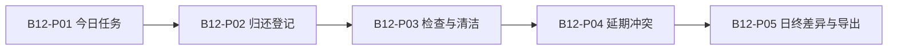

# B12｜信息架构与交互规格

设计草案V1｜原型形态：移动网页软件。使用[本地可点击原型](原型/index.html)评审页面和反馈。

## 页面与材料结构

这是一条典型阅读／操作旅程；生产业务的真实状态转换见[数据状态与权限设计](04-数据状态与权限设计.md)。原型各页是独立演示场景，切页不会在后台建立关联业务记录。

| 页面ID／需求 | 使用角色 | 首屏必须看见 | 主动作 | 失败处理 |
| --- | --- | --- | --- | --- |
| B12-P01 / R01 | 仓管 | 待出订单、器材、当前就绪、冲突 | 核对订单占用 | 同一器材同一时间已被另一单占用，拒绝重复预约。 |
| B12-P02 / R02 | 配送员 | 原订单、选中归还、未还、下一状态 | 登记归还 | 网络断开，本次未提交，请使用应急记录。 |
| B12-P03 / R03 | 授权仓管 | 器材、现状、检查、清洁 | 恢复就绪 | 当前为配送员身份，无权恢复损坏器材。 |
| B12-P04 / R04 | 店主 | 当前订单、后续订单、冲突对象、处理 | 记录人工处置 | 延期仍与后单重叠，不能标为冲突已解决。 |
| B12-P05 / R05 | 仓管 | 基准、对照、异常 | 核对日终清单 | 发现实物与账面不一致，保留差异并调查，不覆盖历史。 |

## 通用交互约定

- 正常态：明确对象、范围、版本、当前角色与可执行动作；前置不满足时解释原因。
- 空态：说明缺什么、由谁提供、怎样进入下一步；不能用空数据展示成功。
- 提交中：真实实现禁重复操作但支持安全重试；原型无网络，不伪装上传进度。
- 异常态：区分阻断错误与可继续的降级警告，保留输入和最后可信状态并给恢复说明；修复后重新验证，不能只隐藏错误提示。
- 无权限或过期：不能露出其他客户／对象内容；界面隐藏不能替代服务端校验。
- 长文本、中文路径和移动屏幕允许换行；状态不能只靠颜色；关键动作键盘可达。

## 原型操作与覆盖范围

点击顶部五个页面入口查看材料，使用“正常状态／异常状态／空状态”评审反馈。正常态（或明确可继续的降级态）勾选核对框后点击主动作，可看一次成功反馈；重复点击被阻止。下一页只切换评审页面；重置演示清除本次日志。

核对框是原型操作控件，不是生产身份验证、业务审批或数据授权。原型不读取本地文件，不联网，不保存真实资料；金额计算、真实文档生成、权限、消息、文件解析、备份恢复与硬件能力都未实现。退回、撤销等业务支路在状态规格中定义，当前原型仅提供关键异常样例，完整支路须后续实现和测试。

## 布局与内容原则

服务项目以交付材料预览呈现；移动本地工具用窄屏卡片；网页软件用任务详情和状态信息。只读示例不意味着最终全部字段只读；生产编辑权限由角色和状态规格确定。文案强调用户任务及结果，不将后台实现细节放进使用流程。

[PRD](../06-产品需求与版本规划/03-产品需求说明书.md) · [评审任务卡](05-原型评审记录.md) · [阶段入口](README.md)
