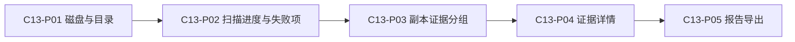

# C13｜信息架构与交互规格

设计草案V1｜原型形态：本地桌面工具。使用[本地可点击原型](原型/index.html)评审页面和反馈。

## 页面与材料结构

这是一条典型阅读／操作旅程；生产业务的真实状态转换见[数据状态与权限设计](04-数据状态与权限设计.md)。原型各页是独立演示场景，切页不会在后台建立关联业务记录。

| 页面ID／需求 | 使用角色 | 首屏必须看见 | 主动作 | 失败处理 |
| --- | --- | --- | --- | --- |
| C13-P01 / R01 | 本机使用者 | 盘A、盘B、目录、授权 | 开始演示扫描 | 目录未获读取权限，停止并显示授权指引。 |
| C13-P02 / R02 | 本机使用者 | 已处理、待读取、源文件变化、状态 | 完成本轮演示 | 备份盘拔出：2项未知，不把部分完成显示为全量验证。 |
| C13-P03 / R03 | 本机使用者 | 组A、组B、组C | 查看证据详情 | 只有历史哈希记录，不能标记当前内容一致。 |
| C13-P04 / R04 | 本机使用者 | 对象、证据、扫描时间、复核条件 | 模拟字节复核 | 读取期间文件被修改，本对象改为未知并要求重扫。 |
| C13-P05 / R05 | 本机使用者 | 内容、输出、历史说明 | 预览报告内容 | 选择源目录作为输出位置，提示改选独立输出目录。 |

## 通用交互约定

- 正常态：明确对象、范围、版本、当前角色与可执行动作；前置不满足时解释原因。
- 空态：说明缺什么、由谁提供、怎样进入下一步；不能用空数据展示成功。
- 提交中：真实实现禁重复操作但支持安全重试；原型无网络，不伪装上传进度。
- 异常态：区分阻断错误与可继续的降级警告，保留输入和最后可信状态并给恢复说明；修复后重新验证，不能只隐藏错误提示。
- 无权限或过期：不能露出其他客户／对象内容；界面隐藏不能替代服务端校验。
- 长文本、中文路径和移动屏幕允许换行；状态不能只靠颜色；关键动作键盘可达。

## 原型操作与覆盖范围

点击顶部五个页面入口查看材料，使用“正常状态／异常状态／空状态”评审反馈。正常态（或明确可继续的降级态）勾选核对框后点击主动作，可看一次成功反馈；重复点击被阻止。下一页只切换评审页面；重置演示清除本次日志。

核对框是原型操作控件，不是生产身份验证、业务审批或数据授权。原型不读取本地文件，不联网，不保存真实资料；金额计算、真实文档生成、权限、消息、文件解析、备份恢复与硬件能力都未实现。退回、撤销等业务支路在状态规格中定义，当前原型仅提供关键异常样例，完整支路须后续实现和测试。

## 布局与内容原则

服务项目以交付材料预览呈现；移动本地工具用窄屏卡片；网页软件用任务详情和状态信息。只读示例不意味着最终全部字段只读；生产编辑权限由角色和状态规格确定。文案强调用户任务及结果，不将后台实现细节放进使用流程。

[PRD](../06-产品需求与版本规划/03-产品需求说明书.md) · [评审任务卡](05-原型评审记录.md) · [阶段入口](README.md)
